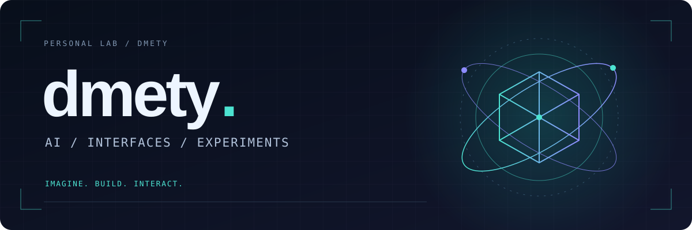
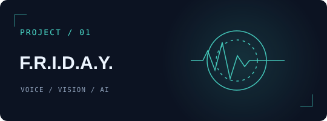
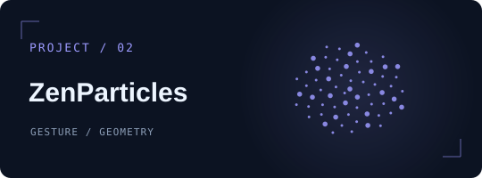
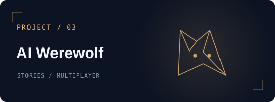
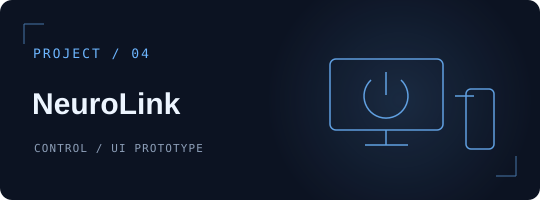

  

  <b>把科幻灵感，写成可以交互的作品。</b> 
  Exploring AI, real-time interaction &amp; the creative web.

  <a href="https://github.com/dmety?tab=repositories">探索项目 ↗</a> &nbsp;·&nbsp;
  <a href="https://github.com/dmety/Friday">F.R.I.D.A.Y. ↗</a> &nbsp;·&nbsp;
  <a href="https://github.com/dmety/-">手势粒子实验 ↗</a>

---

### / ABOUT

Hi, I'm **dmety**. 我用 **TypeScript / React** 探索 AI 与 Web 交互：让界面听见声音、感知手势，也让想象中的科幻控制台出现在浏览器里。

这里收录我的个人项目与实验。你可以从实时 AI 助手开始，也可以进入粒子世界，看看代码能创造什么。

### / SELECTED WORK

<table>
  <tr>
    <td width="50%" valign="top">
      
        
      <b><a href="https://github.com/dmety/Friday">F.R.I.D.A.Y. ↗</a></b>
      
钢铁侠灵感的 AI 交互界面。结合实时语音、摄像头视觉输入与科幻 HUD。

      React · Gemini Live API · Web Audio
    </td>
    <td width="50%" valign="top">
      
        
      <b><a href="https://github.com/dmety/-">ZenParticles ↗</a></b>
      
用双手操控 3D 粒子，以自然语言探索 AI 生成的粒子形态。

      Three.js · MediaPipe · Gemini
    </td>
  </tr>
  <tr>
    <td width="50%" valign="top">
      
        
      <b><a href="https://github.com/dmety/Werewolf_Kill">AI 狼人杀法官 ↗</a></b>
      
AI 生成剧情，结合 P2P 联机、自动游戏流程与浏览器语音播报。

      React · PeerJS / WebRTC · Web Speech
    </td>
    <td width="50%" valign="top">
      
        
      <b><a href="https://github.com/dmety/NeuroLink-Remote">NeuroLink ↗</a></b>
      
赛博风远程控制面板原型：模拟唤醒与关机流程，提供 AI 配置咨询和部署指南。

      TypeScript · React · Gemini · UI Prototype
    </td>
  </tr>
</table>

还有 <a href="https://github.com/dmety/EcoLife"><b>EcoLife ↗</b></a>：围绕碳足迹记录、垃圾分类与绿色生活的 AI 前端实验。

### / TOOLBOX

| 构建界面 | 创造交互 | 接入智能 |
| :--- | :--- | :--- |
| TypeScript · React · Tailwind CSS | Three.js · MediaPipe · WebRTC | Gemini API · Gemini Live API |

  

