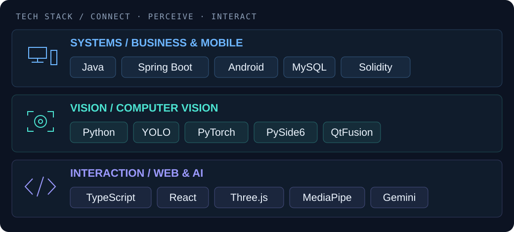
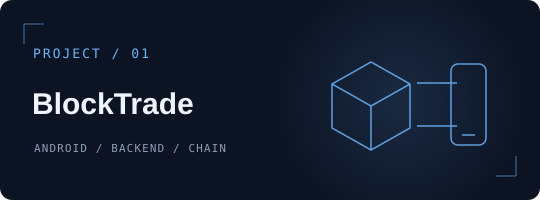
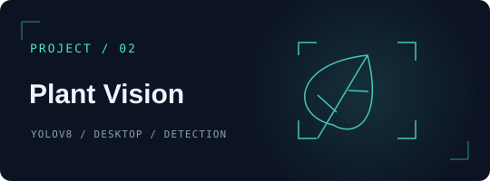
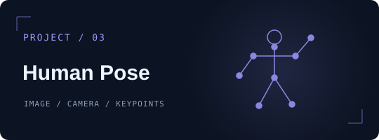

<b>简体中文</b> &nbsp; / &nbsp; <a href="https://github.com/dmety">English ↗</a>

  

  <b>把科幻灵感，写成可以交互的作品。</b> 
  Exploring AI, computer vision &amp; connected systems.

  <a href="https://github.com/dmety?tab=repositories">探索项目 ↗</a> &nbsp;·&nbsp;
  <a href="https://github.com/dmety/NeuroLink-Remote">NeuroLink ↗</a> &nbsp;·&nbsp;
  <a href="https://github.com/dmety/Property_Rights_Trading">BlockTrade ↗</a>

---

### / IDENTITY · 我在构建什么

Hi, I'm **dmety**. 我的项目围绕 **业务系统 × 计算机视觉 × 创意交互** 展开。

**连接多端，感知现实，让交互更有想象力。**

| 方向 | 我在探索 | 从作品开始 |
| :--- | :--- | :--- |
| 🔗 业务与移动端 | 连接 Android、业务 API、数据库与链上合约，探索交易与确权流程 | [BlockTrade ↗](https://github.com/dmety/Property_Rights_Trading) |
| 👁️ 计算机视觉 | 将图像、视频和摄像头输入转为检测结果与姿态可视化 | [植物识别 ↗](https://github.com/dmety/plant-disease-detection) · [姿态识别 ↗](https://github.com/dmety/human-pose-demo) |
| ✨ 创意交互 | 探索 AI 辅助界面、手势交互与科幻风 Web 原型 | [NeuroLink ↗](https://github.com/dmety/NeuroLink-Remote) · [粒子实验 ↗](https://github.com/dmety/-) |

持续构建个人项目，也通过具体的问题修复参与开源。

### / TECH STACK · 技术地图

这些工具出现在我的公开项目中；点击上方作品链接，可以查看它们如何被使用。

### / SELECTED WORK

<table>
  <tr>
    <td width="50%" valign="top">
      
        
      <b><a href="https://github.com/dmety/Property_Rights_Trading">农业产权交易 · BlockTrade ↗</a></b>
      
围绕农业产权交易与确权，连接 Android 客户端、Spring Boot 业务后端与 FISCO BCOS 合约。另含可选 AI 语音 / MCP 服务。

      Java · Android · Spring Boot · MySQL · Solidity
    </td>
    <td width="50%" valign="top">
      
        
      <b><a href="https://github.com/dmety/plant-disease-detection">植物病害识别 ↗</a></b>
      
基于 YOLOv8 的桌面识别示例，支持图片、视频和摄像头输入；包含 PySide6 界面、默认模型权重与训练脚本。

      Python · YOLOv8 · PySide6 · QtFusion
    </td>
  </tr>
  <tr>
    <td width="50%" valign="top">
      
        
      <b><a href="https://github.com/dmety/human-pose-demo">人体姿态识别 ↗</a></b>
      
独立的计算机视觉演示，包含图片姿态分析与摄像头实时识别脚本，探索关键点检测和姿态可视化。

      Python · Ultralytics YOLO · PyTorch
    </td>
    <td width="50%" valign="top">
      
        
      <b><a href="https://github.com/dmety/NeuroLink-Remote">NeuroLink ↗</a></b>
      
赛博风远程控制面板原型：模拟唤醒与关机流程，提供 AI 配置咨询和部署指南。

      TypeScript · React · Gemini · UI Prototype
    </td>
  </tr>
</table>

### / CREATIVE LAB

| 实验 | 探索方向 |
| :--- | :--- |
| [ZenParticles ↗](https://github.com/dmety/-) | 双手操控 3D 粒子，以自然语言探索 AI 生成的粒子形态 · Three.js / MediaPipe / Gemini |
| [AI 狼人杀法官 ↗](https://github.com/dmety/Werewolf_Kill) | AI 剧情、P2P 联机、自动游戏流程与浏览器语音播报 |
| [EcoLife ↗](https://github.com/dmety/EcoLife) | 碳足迹记录、垃圾分类与绿色生活的 AI 前端实验 |

### / OPEN SOURCE

我也在通过具体的问题修复参与开源。这些 PR 已提交，评审与合并进度以链接中的实时状态为准。

| 项目 | 提交的改动 | 记录 |
| :--- | :--- | :--- |
| Microsoft TypeScript | 为 `eval` / `arguments` 类名补充严格模式诊断与回归用例 | [PR #64682 ↗](https://github.com/microsoft/TypeScript/pull/64682) |
| LangGraph Redis | 修正文档中 RedisSaver 的上下文管理用法 | [PR #207 ↗](https://github.com/redis-developer/langgraph-redis/pull/207) |

  

